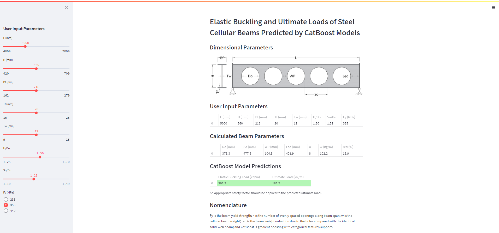

# SCBA-Streamlit-CB

This Streamlit application is a "lite" version of the application at https://github.com/vitdegtyarev/SCBA-Streamlit. 
It predicts the elastic buckling and ultimate loads of steel cellular beams using optimized CatBoost models.

The application is based on the models described in the following preprint: Degtyarev, V.V., Tsavdaridis, K.D. Buckling and ultimate load prediction models for steel perforated beams using machine learning algorithms.

## Instructions on how to use the application

1. Download the content of the repository to the local machine.
2. With Python installed, install the required packages listed in the 'requirements.txt' file.
3. Open command-line interface (cmd.exe).
4. Change to the directory on the local machine where the application was saved.
5. Type the following: streamlit run SCBA.py
6. The application opens in a web browser tab.
7. Use sliders and radio buttons to change beam parameters.

